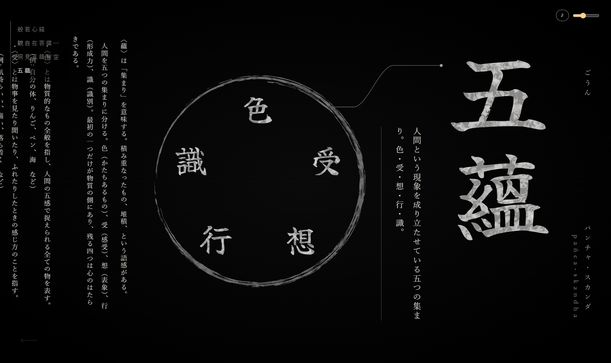

# 深般若 — Graphical Heart Sutra Explorer

般若心経を「文字 → 句 → 語 → 構成要素」と際限なく潜っていける、グラフィカルな訳文兼辞書。
**探索自体が瞑想体験になる UI** がコンセプトです。

[](LICENSE)
[](LICENSE-CONTENT.md)
[](#用語--深度と性能ティアを混同しない)

> *An interactive, vertically-typeset exploration of the Heart Sutra. Zoom from the
> whole sutra into a phrase, a word, and its constituent morphemes — each step a
> continuous, hand-inked transition rendered with WebGPU. UI text is in Japanese.*

<p align="center">
  
</p>

## 動かす

必要なもの: Node.js 22 以上と、WebGPU または WebGL2 が使えるブラウザ。

```sh
git clone https://github.com/yoshiakist/jin-hannya.git
cd jin-hannya
npm install
npm run dev
```

`npm run dev` は筆文字グリフの前計算を挟んでから開発サーバを立て、以後は `content/` を監視する
（`*.yaml` `*.md` `sutra.txt` を保存すると `src/generated/content.json` を作り直し、そのまま HMR に乗る）。
`src/generated/` と `public/glyphs/` はその生成物で、リポジトリには含めていない（clone 直後は
`npm run dev` か `npm run content:build` を先に走らせる）。

| コマンド | 内容 |
|---|---|
| `npm run dev` | グリフ前計算 → 開発サーバ（`content/` を監視） |
| `npm run host` | 同上を LAN に公開（実機確認用） |
| `npm run build` | グラフ検証 → グリフ前計算 → `tsc --noEmit` → 本番ビルド |
| `npm run content:validate` | `content/` の静的検証のみ |
| `npm run content:build` | グリフ前計算のみ |
| `npm run typecheck` | `tsc --noEmit` |

テストランナーは無い。検証は `content:validate` と型検査、あとは画面で確認する。


## 用語 — 深度と性能ティアを混同しない

| 呼称 | 意味 | 例 |
|---|---|---|
| **深度 `L0` / `L1` / `L2` …** | グラフを潜った階層。ユーザーの現在位置 | `L0` = 全文の紙面、`L1` = 句、`L3` = 語 |
| **性能ティア `Tier 1` / `Tier 2` / `Tier 3`** | 実行環境の描画能力 | `Tier 1` = WebGPU、`Tier 2` = WebGL2、`Tier 3` = WebGL 不可 |

「Tier」は性能の話にのみ使う。階層の話には使わない。

## 構成

**2 レイヤー合成 — 組版は DOM、絵は GPU。** 縦組みの長文は `writing-mode: vertical-rl` の DOM オーバーレイ、
筆文字グリフ・粒子・ゆらぎ・発光・描線は WebGPU レイヤー。両者はパンを 1 つの atom から読んで同期します。

Next.js 16（App Router、`output: 'export'`）+ TypeScript + React 19 / @react-three/fiber v9 / three 0.185（`WebGPURenderer` + TSL）/ Jotai / motion / zod。
SSR 無し・全ルート SSG・静的ホスティング前提。ノードごとの実パス URL に title / description / OGP が付く。

```
src/
  scene/    Stage.tsx(Canvas+ティア訂正) Paper.tsx(L0格子) NodeStage.tsx(L1以降/3レイアウト)
            Transition.tsx(遷移演出) Particles.tsx carry.ts sway.ts glyphs.ts tier.ts materials.ts
  overlay/  Overlay.tsx PaperFallback.tsx SpeakButton.tsx AudioControls.tsx LeftArrow.tsx
  nav/      fsm.ts atoms.ts router.ts
  content/  schema.ts loader.ts sutra.ts
  world/    paper.ts(格子寸法) pan.ts(可動域・ドラッグ・拡大) node-layout.ts(L1以降の寸法/overlayInsets)
  audio/    index.ts
  generated/  build-glyphs.ts の出力（索引）。コミットしない
scripts/    build-glyphs.ts svg-path.ts sdf.ts validate-graph.ts
content/    sutra.txt / graph/*.yaml(21) / docs/*.md(21)
public/     glyphs/  build-glyphs.ts の出力（mesh/particles/sdf）。コミットしない
assets/     svg/(筆文字127) pattern/circle.svg bgm/ sfx/ voice/(未収録)
docs/       設計資料
sample_image/  PC モック 3 枚（参照用）
```

## 設計資料

観点ごとの設計は Claude Code の skill（`.claude/skills/`）に分かれています。
作業に関係する観点だけを読み込めばOK。**各 skill が、その観点の正典となっています。**

| skill | 扱う範囲 |
|---|---|
| [`sutra-content`](.claude/skills/sutra-content/SKILL.md) | コンテンツモデル。`sutra.txt` の `range`、YAML グラフ、`id` 命名規約、`label`/`reading` の列の切れ目、ビルド時検証 |
| [`doc-writing`](.claude/skills/doc-writing/SKILL.md) | 原稿の深度別の役割・語り口（L1 簡訳 → L4 原義 → L5 教学） |
| [`paper-grid`](.claude/skills/paper-grid/SKILL.md) | L0 の紙面。格子の組み方、`index → (column, row)`、意味の区切りを見せない方針、hover で範囲だけが光る表現 |
| [`node-screen`](.claude/skills/node-screen/SKILL.md) | L1 以降の画面文法。モック分析、3 種の `layout`、`node-layout.ts` の単独責務、`overlayInsets` |
| [`transition-fx`](.claude/skills/transition-fx/SKILL.md) | 遷移演出。持ち越される字、散開と凝集、尺とカーブ、面の用意をやり直さない理由 |
| [`pan-zoom`](.claude/skills/pan-zoom/SKILL.md) | パンと拡大。可動域の実測、ばねを 1 箇所に置く理由、ドラッグの捕捉 |
| [`ink-visuals`](.claude/skills/ink-visuals/SKILL.md) | デザイントークン、墨のかすれ、ゆらぎ、SDF による琥珀グロー、グリフと円相の前計算 |
| [`navigation-fsm`](.claude/skills/navigation-fsm/SKILL.md) | 遷移フェーズ FSM、URL 同期、現在位置インジケータ、左矢印、読み上げボタン |
| [`reading-progress`](.claude/skills/reading-progress/SKILL.md) | 読破の記録。判定の深さ、訪問済みの持ち方、青白く灯る紙面 |
| [`audio-design`](.claude/skills/audio-design/SKILL.md) | BGM の常時ループと配信方式、上限ゲイン、SFX、収録音声の読み上げとダッキング |
| [`perf-tier`](.claude/skills/perf-tier/SKILL.md) | 2 レイヤー合成、ティア判定と訂正、ティアごとの落とし所、技術スタック、環境差の落とし穴 |

| 資料 | 内容 |
|---|---|
| [`docs/status.md`](docs/status.md) | 実装状況、完了条件、未確認の項目、未決事項 |
| [`CLAUDE.md`](CLAUDE.md) | 毎回の起動時に要る最小限の索引 |

## 貢献について

不具合の報告・環境差（特に WebGPU まわり）の報告は歓迎です。issue へどうぞ。

ただし `content/` 以下の訳文と解説文は CC BY-NC-ND 4.0（改変物の再配布不可）で、
文面そのものへの変更を PR として受け取ることはできません。誤りを見つけた場合は PR ではなく issue で指摘して頂きたいです。

## ライセンス

このリポジトリはコードとコンテンツで異なるライセンスを持ちます。

**Code is licensed under the [MIT License](LICENSE).**
`src/`、`app/`、`scripts/`、およびルートの設定ファイル（`package.json` / `next.config.ts` / `tsconfig.json`）が対象。

**All textual content and modern translations contained in this repository are licensed under
[CC BY-NC-ND 4.0](LICENSE-CONTENT.md).**
`content/`（訳文・解説文・ノードのメタデータ）、`assets/`（筆文字 SVG・円相・音声）、`sample_image/` が対象。
対象範囲と条件の詳細は [`LICENSE-CONTENT.md`](LICENSE-CONTENT.md) を見ること。

なお `content/sutra.txt` が収める般若心経の本文そのものはパブリックドメインであり、上記は本リポジトリ独自の寄与（現代語訳・解説・構造化・作画）にかかります。

---

### 補足: 本ドキュメントの方針

経文本文および解説文の本文テキストは、意図的にドキュメントへ含めていません。
これらは `content/graph/*.yaml` の `summary` および `content/docs/*.md` が唯一の出所であり、 README・skill・コード・コミットメッセージに複製しません。
